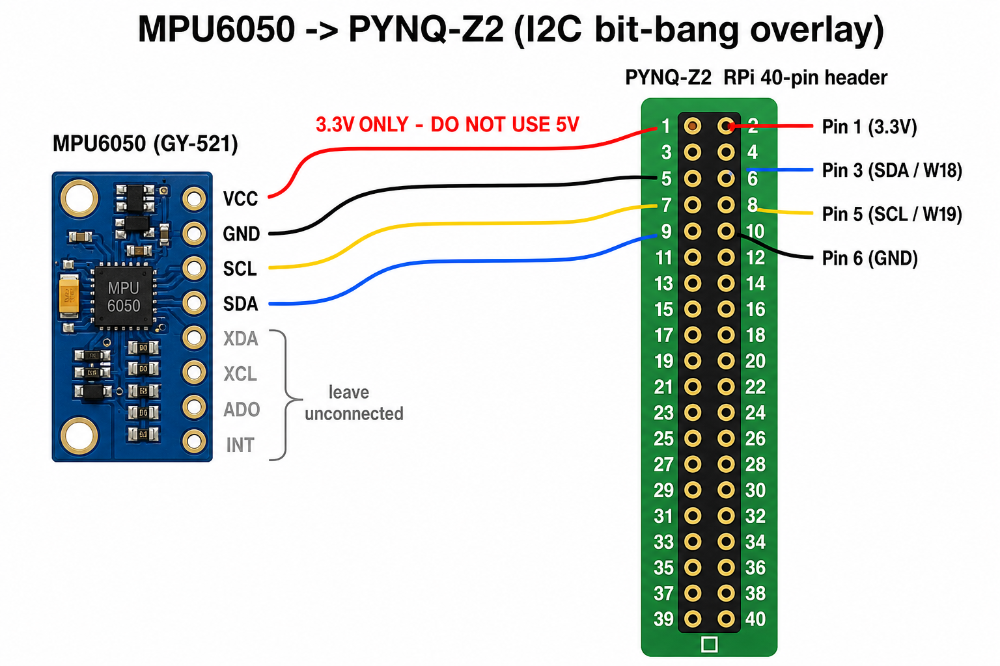

# PYNQ-Z2 Sensor Platform

FPGA-accelerated sensor stack for the **TUL PYNQ-Z2** (Xilinx Zynq-7020): **NEO-6M GPS** over AXI UART and **MPU6050** (6-axis IMU) over **bit-bang I2C** via AXI GPIO. Both paths use direct **`/dev/mem` MMIO** — no PYNQ Overlay Python API required.

| Subsystem | Interface | Overlay | Live dashboard |
|-----------|-----------|---------|----------------|
| Ublox NEO-6M GPS | AXI UART Lite @ `0x42C00000` | `gps_uart` | `http://<board>:8080` (GPS) |
| MPU6050 (GY-521) | AXI GPIO I2C @ `0x41200000` | `i2c_gpio` | `http://<board>:8080` (IMU) |

---

## MPU6050 — Live Web Dashboard

Real-time accelerometer, gyroscope, orientation (pitch/roll), temperature, 3D attitude cube, and scrolling charts.


Typical readings with the board flat on a desk: **Z ≈ 1.0 g**, pitch/roll near 0°, gyro bias within a few °/s.

---

## GPS — Live Web Dashboard

NMEA parsing (`GGA`, `RMC`, `GSV`), map position, fix quality, and satellite SNR bars.


> Map tiles are loaded by the browser from the internet; the board only serves JSON and HTML.

---

## Hardware

### MPU6050 (I2C) — Raspberry Pi header

| MPU6050 pin | PYNQ-Z2 RPi header | FPGA pin | Notes |
|-------------|-------------------|----------|-------|
| **VCC** | **Pin 1** (3.3 V) | — | **Do not use 5 V** — module pull-ups tie to VCC |
| **GND** | **Pin 6** | — | Ground |
| **SDA** | **Pin 3** | **W18** | AXI GPIO bit 0 |
| **SCL** | **Pin 5** | **W19** | AXI GPIO bit 1 |
| AD0, INT, XDA, XCL | — | — | Leave unconnected (address `0x68`) |



### NEO-6M GPS (UART) — Raspberry Pi header

| GPS pin | RPi header | FPGA pin | Direction |
|---------|------------|----------|-----------|
| VCC | Pin 1 (3.3 V) or Pin 2 (5 V) | — | Power |
| GND | Pin 6 | — | Ground |
| TX | **Pin 10** | Y6 | GPS → FPGA RX |
| RX | **Pin 8** | V6 | FPGA TX → GPS RX |

Pin assignments match the official PYNQ-Z2 `base.xdc` (V6 / Y6).

---

## Quick Start (PYNQ SD card)

Default USB-Ethernet IP is often **`192.168.2.99`**. Login: `xilinx` / `xilinx`.

### 1. Load the I2C overlay (MPU6050)

```bash
sudo cp i2c_gpio.bin /lib/firmware/
echo i2c_gpio.bin | sudo tee /sys/class/fpga_manager/fpga0/firmware
```

### 2. Run the IMU dashboard

```bash
cd sensors
sudo bash runweb.sh    # starts http://192.168.2.99:8080
```

Or read values in the terminal:

```bash
sudo python3 mpu6050.py --axi-gpio
sudo python3 axi_gpio_i2c.py --scan
```

### 3. GPS (optional, separate overlay)

```bash
echo gps_uart.bin | sudo tee /sys/class/fpga_manager/fpga0/firmware
sudo python3 gps_web.py --skip-overlay
```

---

## Architecture

```
┌─────────────────────────────────────────────────────────┐
│  Linux (ARM) — Python                                   │
│  mpu_web.py / mpu6050.py  →  /dev/mem @ 0x41200000      │
│  gps_web.py / neo_gps_pynq.py  →  /dev/mem @ 0x42C00000 │
└───────────────────────────┬─────────────────────────────┘
                            │ AXI (GP0)
┌───────────────────────────▼─────────────────────────────┐
│  PL (FPGA)                                              │
│  axi_gpio_0  →  bit-bang I2C  →  RPi Pin 3/5 (W18/W19) │
│  axi_uartlite_0  →  9600 baud  →  RPi Pin 8/10 (V6/Y6)  │
└─────────────────────────────────────────────────────────┘
```

**I2C bit-bang:** Open-drain on bidirectional GPIO. `TRI=1` releases the line (pull-up high); `TRI=0` drives low. No Linux `i2c-dev` or device-tree node required.

---

## Repository Layout

```
neo_gps/
├── sensors/
│   ├── axi_gpio_i2c.py      # MMIO bit-bang I2C master
│   ├── mpu6050.py           # IMU reader (AXI GPIO or smbus)
│   ├── mpu_web.py           # Live IMU web dashboard
│   ├── setup_mpu6050.sh     # Deploy helper (wget + fpga_manager)
│   └── runweb.sh            # Start dashboard in background
├── neo_gps_pynq.py          # GPS reader (MMIO UART)
├── gps_web.py               # GPS web dashboard
├── output/
│   ├── i2c_gpio.{bit,bin,hwh}   # MPU6050 overlay artifacts
│   └── gps_uart.{bit,bin,hwh}   # GPS overlay artifacts
├── docs/
│   ├── mpu6050_dashboard.png
│   ├── mpu6050_wiring.png
│   └── dashboard.png
└── vivado/
    ├── build_i2c_gpio.tcl   # Build I2C overlay (Vivado 2022.2)
    ├── build_gps_uart.tcl   # Build GPS overlay
    ├── rpi_i2c.xdc          # SDA=W18, SCL=W19
    └── rpi_uart.xdc         # UART V6/Y6
```

---

## Rebuild Bitstreams (Vivado 2022.2)

```bat
cd vivado
run_build_i2c.bat    REM → output/i2c_gpio.*
run_build.bat        REM → output/gps_uart.*
```

---

## Requirements

- **Board:** TUL PYNQ-Z2, PYNQ image (tested on v3.1 / Linux 5.4)
- **Tools:** Vivado 2022.2 (for rebuilding overlays)
- **Sensors:** GY-521 (MPU6050), Ublox NEO-6M (9600 baud NMEA)

---

## License

MIT — see [LICENSE](LICENSE).
