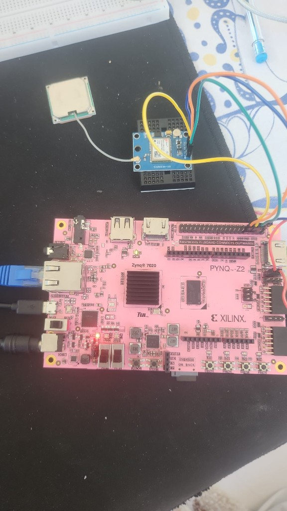
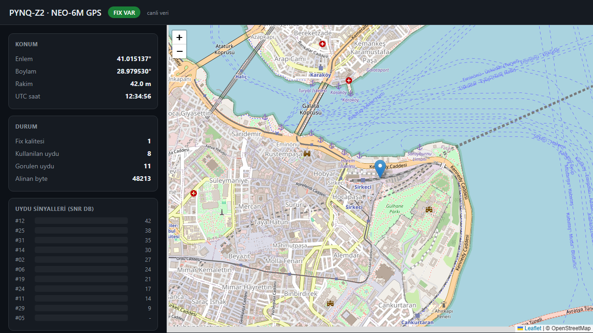
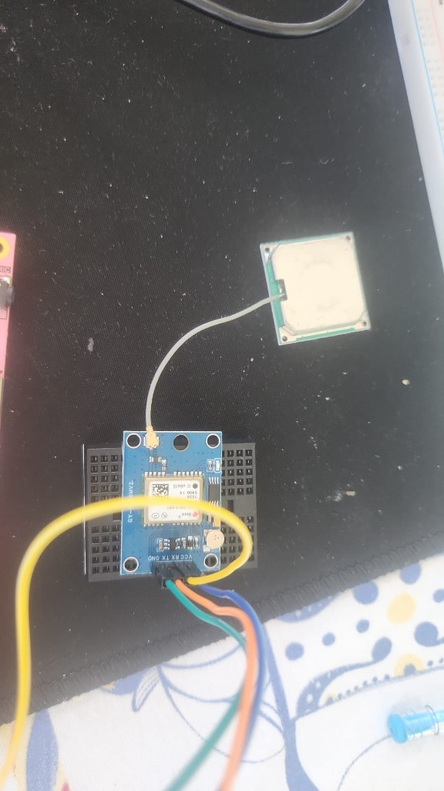
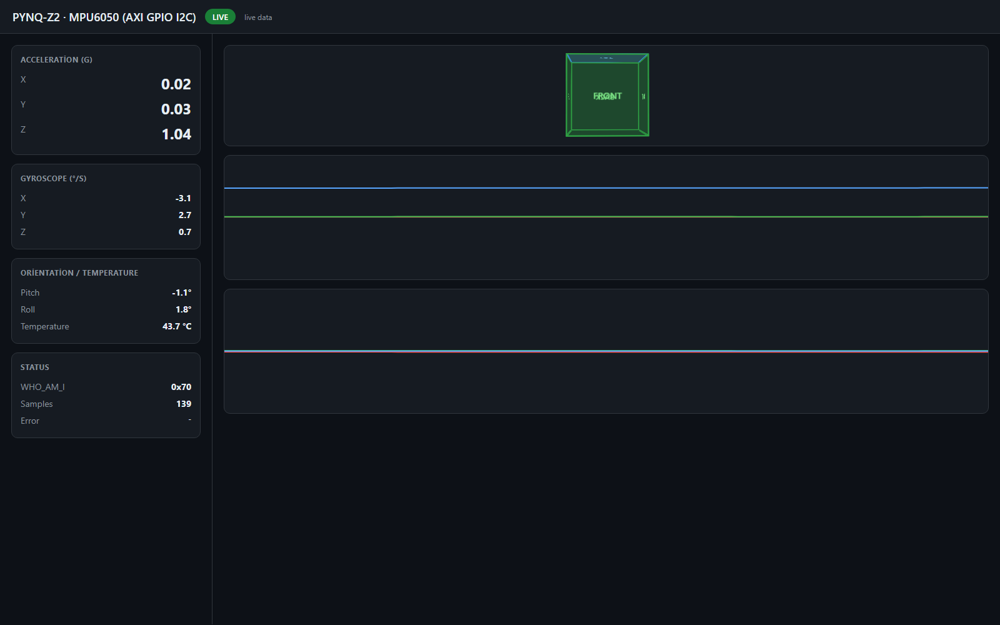

# PYNQ-Z2 + NEO-6M GPS — FPGA Web Dashboard

[](https://github.com/Alp2246/pynq-z2-neo6m-gps/releases/tag/v1.0.0)
[](LICENSE)
[](https://www.tul.com.tw)

Live GPS on the **TUL PYNQ-Z2** (Zynq-7020): custom Vivado overlay, **AXI UART Lite** at `0x42C00000`, Python **MMIO** (`/dev/mem`), and a browser dashboard with map, fix status, satellite SNR, and **decoded NMEA** messages.



| | |
|---|---|
| **Board** | TUL PYNQ-Z2 (PYNQ SD image, tested v3.1) |
| **GPS** | u-blox NEO-6M (GY-NEO6MV2), 9600 baud NMEA |
| **FPGA IP** | `axi_uartlite_0` → RPi pins **8** (TX) / **10** (RX) |
| **Software** | `gps_web.py` — no PYNQ Overlay Python API |
| **Dashboard** | `http://<board-ip>:8080` |

> **Live demo:** fix + 8 satellites @ ~36.77°N 34.54°E — see [sample API output](docs/sample_live_output.json)

---

## Features

- **Live map** (OpenStreetMap tiles from the PC browser)
- **Fix badge**, lat/lon/alt, UTC time, satellite count
- **SNR bar chart** per visible satellite (from `$GPGSV`)
- **NMEA tab** — GGA, RMC, GSA, GSV, VTG, GLL decoded field-by-field with Turkish explanations
- **Terminal reader** — `neo_gps_pynq.py` for PuTTY / SSH
- **Pre-built bitstream** — `output/gps_uart.bin` (load via `fpga_manager`)



---

## Hardware

### Wiring diagram




| NEO-6M pin | PYNQ-Z2 RPi header | FPGA pin | Wire colour (typical) |
|------------|-------------------|----------|------------------------|
| **VCC** | Pin **1** (3.3 V) | — | Red / orange |
| **GND** | Pin **6** | — | Black |
| **TX** | Pin **10** | Y6 | GPS → FPGA RX |
| **RX** | Pin **8** | V6 | FPGA TX → GPS RX |

Pin names match `vivado/rpi_uart.xdc` and the official PYNQ-Z2 `base.xdc` (V6 / Y6).

> Antenna must see open sky for a fix. After boot, load `gps_uart.bin` — the GPS overlay is separate from the I2C/IMU overlay.

---

## Quick start (on the board)

SSH: `xilinx@192.168.2.99` (default PYNQ USB-Ethernet), password `xilinx`.

```bash
cd ~/neo_gps
echo gps_uart.bin | sudo tee /sys/class/fpga_manager/fpga0/firmware
cat /sys/class/fpga_manager/fpga0/state    # must print: operating
bash start_web.sh
```

Open in a browser: **http://192.168.2.99:8080**

**Important:** run only **one** GPS program at a time (`gps_web.py` *or* `neo_gps_pynq.py`). Two processes on the same UART cause **bus error**.

Terminal-only:

```bash
sudo python3 neo_gps_pynq.py --probe    # 10 s NMEA dump
sudo python3 neo_gps_pynq.py            # continuous reader
```

---

## Architecture


```
Browser  ←HTTP→  gps_web.py  ←MMIO→  axi_uartlite_0  ←UART→  NEO-6M
                  :8080              0x42C00000         9600 baud
```

NMEA sentences (`$GPGGA`, `$GPRMC`, `$GPGSV`, `$GPGSA`, …) are parsed in Python. The web UI exposes each message type on the **NMEA** tab with human-readable field labels.

---

## Live output example

From a running board ([full JSON](docs/sample_live_output.json)):

```json
{
  "fix": true,
  "quality": 1,
  "lat": 36.767159,
  "lon": 34.541761,
  "alt": 48.0,
  "sats_used": 8,
  "satellites": [
    {"prn": "01", "elev": "24", "azim": "176", "snr": 34},
    {"prn": "07", "elev": "28", "azim": "206", "snr": 26}
  ]
}
```

---

## Repository layout (GPS)

```
neo_gps/
├── gps_web.py              # Live web dashboard + NMEA decoder UI
├── neo_gps_pynq.py         # MMIO UART reader / probe
├── start_web.sh            # One-command start on the board
├── output/gps_uart.{bin,bit,hwh}
├── docs/
│   ├── gps_hardware_setup.png
│   ├── neo6m_module.png
│   ├── wiring_diagram.svg
│   ├── architecture.svg
│   ├── dashboard.png
│   ├── sample_live_output.json
│   └── README_TR.md
└── vivado/
    ├── build_gps_uart.tcl
    └── rpi_uart.xdc
```

---

## Also in this repo: MPU6050 (I2C)

Bit-bang I2C via **AXI GPIO** @ `0x41200000`, live IMU web dashboard, separate overlay `i2c_gpio.bin`.



See wiring and setup in [CHANGELOG.md](CHANGELOG.md) or run `cd sensors && sudo bash runweb.sh` after loading `i2c_gpio.bin`.

---

## Rebuild bitstream (Vivado 2022.2)

```bat
cd vivado
run_build.bat          REM → output/gps_uart.*
run_build_i2c.bat      REM → output/i2c_gpio.*
```

---

## Requirements

- TUL PYNQ-Z2 + PYNQ image (Linux 5.4+)
- u-blox NEO-6M @ 9600 baud
- Vivado 2022.2 (only if rebuilding overlays)
- PC browser with internet (for map tiles)

---

## License

MIT — see [LICENSE](LICENSE).

---

🇹🇷 [Türkçe kurulum ve sorun giderme](docs/README_TR.md)
